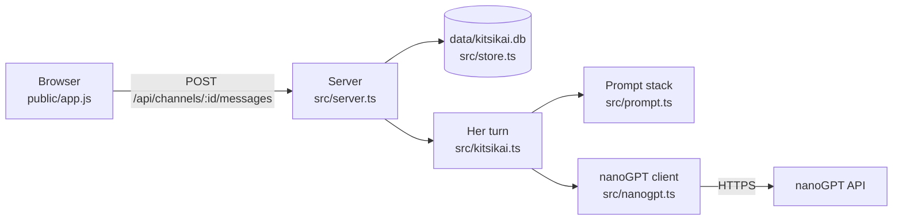

# Stage 1: how it works

Stage 1 is the smallest complete Kitsikai: one channel, `#general`, where you text her and she texts back. According to [DESIGN.md](../DESIGN.md), its new concept is **reusing code across projects**: almost everything here came from [Aettica](https://github.com/626andup-cmyk/aettica), the owner's earlier app, and was adapted rather than written from scratch.

This document explains what was reused, what was changed and why, and how the pieces fit together.

## The big picture



Three programs are involved, exactly as in Aettica:

1. **The browser** shows the chat and sends your actions to the server. It never talks to nanoGPT and never sees your API key.
2. **The server**, run by Bun in Termux on your phone, holds all the data in an SQLite database and decides what happens.
3. **nanoGPT**, on the internet, runs the language model.

## Concept: reusing code across projects

There are three common ways to reuse code from one project in another:

| Way | What it means | Good when |
| --- | --- | --- |
| **Fork** | Copy the whole project and change it | The new project is mostly the old one |
| **Library** | Put shared code in a package both projects install | Both projects change the shared code often, and together |
| **Copy and adapt** | Copy the files you need, then make them yours | The projects will grow apart |

DESIGN.md chose **copy and adapt** ("a fresh repo, not a fork"). Kitsikai and Aettica share a design language and plumbing, but Kitsikai has no scenes, notebook, or roleplay modes, and Aettica will never have a planner. A fork would drag all of Aettica's history and features along; a shared library would force every change to work for both apps. Copying lets each app grow freely.

The cost of copying is that a bug fixed in one app isn't automatically fixed in the other. To make that manageable, copied files say so at the top ("Copied from Aettica"), and they were changed as little as possible, so comparing the two versions is easy.

Both projects use the **GNU AGPL v3** licence, and the same person owns both, so copying is allowed. (If you copy code from someone else's project, check its licence first.)

### What came from Aettica

| File | Copied | Changed |
| --- | --- | --- |
| `src/nanogpt.ts` | As is | Wording only |
| `src/toolcalls.ts` | As is | Wording only |
| `src/profiles.ts` | Almost as is | Jobs are now *chat* (and later screenshot reading and the processing writer), listed in `ASSIGNMENT_KEYS` so deleting a profile resets any job using it |
| `src/themes.ts` | As is | Imports its errors from `errors.ts` |
| `src/config.ts`, `src/errors.ts` | As is | `PermissionError` left behind (no notebook permissions) |
| `src/db.ts`, `src/store.ts` | The idea and structure | New tables: no scenes, modes, characters or notebook |
| `src/partner.ts` → `src/kitsikai.ts` | The "takes a turn" function and the tool test | No scenes, comments or tools yet (tools return in stage 6) |
| `src/prompt.ts` | The layered prompt idea | New layers for a friend who texts, not a roleplay writer |
| `src/server.ts` | Routing, error handling, static files, JSON-only check | Kitsikai's routes |
| `public/glass.js` | As is | `#aettica-goo` became `#kitsikai-goo` |
| `public/style.css` | Trimmed copy | Literary, scene, notebook, inbox and comment styles removed; `--partner-color` became `--kitsikai-color` |
| `public/app.js`, `public/index.html` | Trimmed copy | Only chat, settings, profiles and appearance |
| `themes/` | All six themes | The two colour tokens renamed |
| `public/sw.js`, `manifest.webmanifest` | As is | Name and a new icon |
| `test/helpers.ts`, three test files | As is | The fake nanoGPT is the same |

Left behind on purpose: scenes, literary and casual modes, the notebook, permissions, comments, proposals and the inbox.

## The core rule: one "takes a turn" function

The most important idea carried over is Aettica's **core rule**: *a turn never requires a user message*. There is exactly one function that makes Kitsikai write, `Kitsikai.takeTurn(channelId, trigger)` in `src/kitsikai.ts`, and it never receives your message as an argument. It reads what's saved in the channel, builds the prompt, asks the model, and saves the reply.

Because of that, anything can start a turn:

- sending a message (the server saves it, then calls `takeTurn`)
- the **Her turn** button (it calls `takeTurn` directly)
- **Regenerate** (it calls `takeTurn` with the ids of the reply to replace)
- in stage 8, a timer, when she decides to text you first

Stage 8 won't need to change how turns work, only add a new caller. That's the whole point.

A few things `takeTurn` takes care of:

- **One turn per channel.** A second request while she's writing gets a "busy" error (HTTP 409), so tapping Send twice can't make her answer twice.
- **Stop.** Each turn has an `AbortController`. The Stop button calls `cancel`, which aborts the request to nanoGPT; nothing is saved, and the channel is free straight away.
- **Regenerate safely.** The new reply is written first; only then are the old messages deleted, in the same database transaction. If the new one fails, you keep the old one.
- **A clock.** `takeTurn` asks `clock()` for the time instead of reading it directly, so tests can pretend it's any time they like. This matters a lot from stage 3 on.

## The prompt

`src/prompt.ts` builds what the model reads every turn: one `system` message made of labelled sections, then the conversation.

```
## Who you are
You are Kitsikai, the user's friend. You text each other ...   (fixed framing)
You're Kitsikai: warm, a little teasing ...                     (her persona, editable)
The person you're texting is Sam.                               (if you set your name)

## How you text
Write only your next text message ...

## Right now
It's Saturday, September 26, 2026, 4:12 PM.

## Model notes
...                                                             (the profile's notes, if any)
```

Her persona starts from `defaults/persona.md` and can be edited in Settings. The framing above it is fixed, because it's the idea of the app: she's a friend texting you, not an assistant.

When the conversation doesn't end on your message (she's starting an empty channel, or continuing after herself), the prompt ends with a short "app note" so the model knows what's being asked. It's never saved or shown.

**Preview prompt** in channel settings shows exactly what the next turn would send, built by the same `promptForChannel` function the turn uses.

## The database

Everything is in one SQLite file, `data/kitsikai.db`. Stage 1 has five tables:

```
settings           key/value pairs (her name, persona, history limit, theme...)
channels ──< messages
profiles ──< roulette_profiles >── roulettes
```

The layout is built by **migrations** in `src/db.ts`, like Aettica's: a numbered list of steps, where the database remembers the last step it ran (`PRAGMA user_version`). Each later stage adds a step at the end, so your data is upgraded automatically when you update.

A message records who wrote it (`user` or `kitsikai`), when, and for hers, which model and profile wrote it. Messages written together share a **turn id**; that matters from stage 2, when one reply can be several bubbles.

## The web app

`public/` is plain HTML, CSS and JavaScript with no build step, as in Aettica. `app.js` keeps what's on screen in a `state` object, talks to the server with `fetch`, and redraws with `render...` functions. The server is always the source of truth.

Carried over from Aettica and working as before: the sidebar (with one channel for now), Stop, Try again after an error, Edit, Delete, Regenerate and "Regenerate with…", Preview prompt, the profile editor with **Test tools**, roulettes, and all of Appearance: themes, sliders, Full/Lite/Automatic glass, and the theme editor. The page also notices when the server has been updated and reloads itself.

One small change: **Enter sends**, like texting (Shift+Enter makes a new line). In Aettica, Enter made a new paragraph, because roleplay posts are long.

## Tests

`bun test` runs everything against a fake nanoGPT, so no key or credit is needed:

- `test/server.test.ts`: the whole server end to end: sending, failing, retrying, Stop, regenerating, settings, channels, profiles, themes, static files.
- `test/store.test.ts`, `test/prompt.test.ts`: the database and the prompt.
- `test/profiles.test.ts`, `test/themes.test.ts`, `test/toolcalls.test.ts`: copied from Aettica, and still passing, which shows the copied code works in its new home.
- `test/ui.test.ts`: the real web app in a headless Chromium browser, driven by [Playwright](https://playwright.dev). These are skipped when there's no browser (like on the phone).
