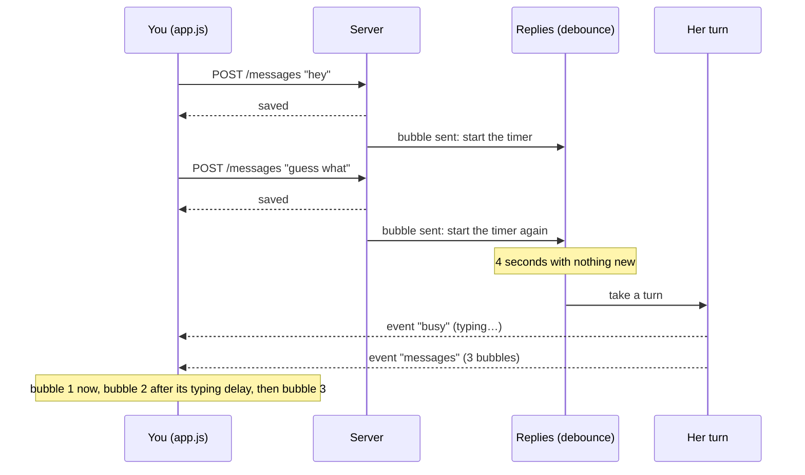

# Stage 2: how it works

Stage 2 makes Kitsikai feel like texting a person. You get **channels** (with topics and a home channel), and she texts in **bubbles** that appear one at a time with a typing indicator, a few seconds after you've *finished* your thought. According to [DESIGN.md](../DESIGN.md), its new concept is **timing and async rendering**: things that happen later, not straight away, and showing them as they arrive.

## The big picture

In stage 1, everything happened inside one request: you pressed Send, the browser waited, and the answer to that request carried her reply. Stage 2 breaks that apart:



Three new pieces make this work: the **events stream**, the **debounce**, and the **reveal queue**.

## Concept 1: things that happen later (async)

Code normally runs one line after another. But a lot of what an app does is *waiting*: for the network, for a timer, for you. JavaScript handles waiting with **asynchronous** code: instead of stopping everything, you say "when this is done, do that", and carry on.

You've already seen the main tool for this, `async`/`await`: `await fetch(...)` pauses *that function* until the answer comes, while the rest of the app keeps working. Stage 2 adds two more:

- **Timers**: `setTimeout(fn, 4000)` runs `fn` in 4 seconds. `clearTimeout` cancels it. That's all the debounce is made of.
- **Events**: something outside your code (a click, a message from the server) calls a function you registered earlier with `addEventListener`. You don't know when; you just say what to do when it happens.

## Concept 2: the events stream (Server-Sent Events)

Her reply now comes *after* your request has finished, so the server needs a way to tell the app "here's something new" without being asked. `src/events.ts` does this with **Server-Sent Events** (SSE):

- The app opens one request, `GET /api/events`, and the server never finishes answering it.
- Whenever something happens, the server writes a line down that open response: `data: {"type":"messages",...}` followed by a blank line.
- The browser's built-in `EventSource` (in `public/app.js`, `connectEvents`) reads those lines and calls our code for each.

The events are:

| Event | Sent when |
| --- | --- |
| `messages` | New messages were saved in a channel: yours, or her reply (with `replacedIds` for a regeneration) |
| `busy` | The channels where she's writing changed. The app shows the typing indicator. |
| `deleted` | Messages were deleted |
| `turn-error` | A reply she started on her own (after the wait) failed. The app shows the error with Try again. |
| `channels` | The channel list changed |

Why SSE and not something fancier (WebSockets)? SSE only goes one way, server to app, which is all we need; the app still talks to the server with ordinary requests. It's plain HTTP, and `EventSource` **reconnects by itself** when the connection drops, like when the phone locks or the server restarts.

Events are *hints*. The database is still the source of truth, so every time the stream reconnects, or you come back to the app, it reloads what's on screen (`catchUp` in app.js) instead of hoping it saw every event. And because the same message can arrive twice (from the stream *and* as the answer to Regenerate), `receiveMessages` skips messages it already has.

The service worker (`public/sw.js`) leaves `/api/events` alone, since it's a response that never ends.

## Concept 3: the debounce

You text in bursts: "hey", "so guess what", "the manager moved my break AGAIN". If she answered each bubble the moment it arrived, she'd reply to "hey" while you were still typing. So `src/replies.ts` makes her wait:

1. You send a bubble → a timer starts (Settings → *Wait before replying*, default 4 seconds).
2. You send another → the timer starts again from zero.
3. You're still typing → the app pings `POST /api/channels/:id/typing` every second and a half or so, and if she's waiting, the timer starts again too.
4. The timer runs out → she takes her turn, and sees everything you sent.

Many quick events turning into one action once they stop is called a **debounce**. (The word comes from electronics: a pressed button physically bounces and sends several signals; debouncing turns them into one press.)

Details worth knowing:

- **The timers live on the server**, not in the browser. If you send a message and lock your phone, she still replies.
- **If she's already writing** when you send another bubble, that reply is out of date: it's stopped (nothing was saved yet) and she starts waiting again. It's the same `cancel` as the Stop button.
- **Stop** also cancels the wait.
- When the timer fires, she only replies if the channel still ends on your message. If you deleted it meanwhile, there's nothing to answer.
- Each channel has its own timer.
- **Bubbles you send together form one turn**: each gets the turn id of your previous bubble, if she hasn't replied since.

## Bubbles

She's asked to put `<cht>` between bubbles (`src/prompt.ts`, "How you text"), the texting style from the owner's Lumiverse extension and Tiny RP:

```
omg wait <cht> you actually said that to him?? <cht> legend
```

`splitBubbles` in `src/bubbles.ts` turns that into three messages that share a turn id. It forgives untidy markers (`<CHT>`, `< cht >`, `</cht>`), treats a reply with no markers as one bubble, and ignores empty pieces.

The conversation she reads uses the same format: a run of bubbles from the same person becomes one message with ` <cht> ` between them, **yours and hers**. Models copy the patterns they see, so showing the format in every turn keeps her writing it.

**Regenerate** replaces her whole last turn: every bubble.

### Time notes

With conversations spread over a day, she needs to know when time has passed, or she'll say "good morning" at night. When an hour or more passes between two messages, the later one starts with a note like `[5:30 PM, 8 hours later]` (or `[Sun 9:00 AM, 2 days later]` when the day changed). She's told these come from the app and never to write them; if a model copies one anyway, `stripTimeMarkers` takes it out.

## Concept 4: async rendering (the reveal queue)

When her three bubbles arrive, the app doesn't show them all at once. `public/app.js` puts them in `reveal.queue` and `pumpReveal` shows them one at a time:

- The **first** bubble of a reply appears as soon as it arrives. Writing it took time already, and the typing indicator was showing meanwhile.
- Each **next** bubble waits `typingBaseMs + characters × typingPerCharMs` (Settings → Timing; defaults 600 ms + 40 ms per character, no cap), with the typing indicator showing.
- **Double-tap the typing indicator** to show the rest straight away. A double tap is two taps within 350 ms, checked by hand, because phones don't always send a `dblclick`.
- **History renders instantly**: opening a channel or reloading shows everything at once. Only bubbles that just arrived are staggered.
- Your own bubbles appear instantly, faded until the server confirms them.

The typing indicator (`.status`) now means two things: she's writing (the server said `busy`, and **Stop** is available), or her bubbles are still appearing (it gets the `revealing` class, and double-tapping it skips ahead).

## Channels

Channels split up the conversation, but not her: she remembers everything, and the prompt says so.

- **Create** with the + at the top of the channel list. Names are made Discord-style: "Work Stuff" becomes `#work-stuff`.
- **Topic**: a short description, like Discord's ("work stuff, venting about shifts"). It shows in the channel header, and she sees her channel's topic and the others' in the prompt ("Where you're texting"). In stage 8 she'll use topics to choose where to text you.
- **Home channel** (channel settings): where she texts you when nothing fits better. Until you choose one, it's the first text channel, and if yours is deleted, it goes back to that. The server's `homeChannel()` and the app's `homeChannelId()` work it out the same way.
- **Reorder** with ↑ and ↓ in channel settings, **rename**, and **delete** (not the last text channel: she needs somewhere to talk). Deleting a channel also stops any wait or reply in it.
- A channel where she wrote something you haven't seen gets an **unread** dot.

The database gained one column, `channels.topic` (migration 2). Bubbles needed nothing new: they're messages sharing a turn id, which stage 1 already had.

## Tests

- `test/replies.test.ts`: bubble splitting, the debounce (with real, short timers: waiting until you stop, typing, a new bubble interrupting her, Stop, deleted messages, separate channels), and the events stream, including reading a real SSE response.
- `test/channels.test.ts`: creating, topics in the prompt, reordering, deleting, the home channel, and timing settings.
- `test/ui.test.ts` gained browser tests: bubbles appearing one by one with the typing indicator, double-tap to skip, quick bubbles getting one reply, and new channels and unread dots.

The server tests call `app.replies.flush()` to skip the wait instead of sleeping for it. That's why `Replies` has a `flush` method: code is easier to test when time can be skipped.
