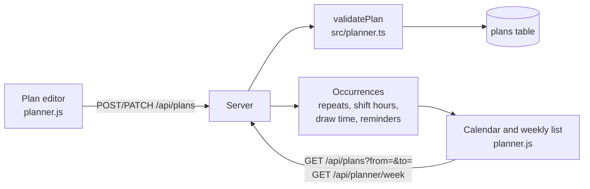

# Stage 3: how it works

Stage 3 adds the 📅 **planner channel**: your shifts and plans, as a month calendar and a weekly list. According to [DESIGN.md](../DESIGN.md), its new concept is **dates, times, overnight ranges and recurrence**, which turn out to be one of the trickiest parts of programming. This document explains why, and how Kitsikai keeps it simple.

She doesn't see your plans yet (that's stage 6) or send reminders (stage 8). This stage is about getting the data right.

## The big picture



The app sends and receives *plans*; the server does every calculation. The browser only draws what it's given, so there's one place where the rules live (`src/planner.ts`), and it's the place the tests check.

## Concept 1: why dates and times are hard

"Tuesday at 3" seems simple. But a computer's idea of time is a single number: milliseconds since January 1, 1970, in UTC (the time in London, without summer time). Turning that number into "Tuesday at 3" depends on **where you are**, and that changes twice a year with daylight saving. So:

- A day isn't always 24 hours. The night the clocks go back is 25 hours long, so a 10 PM to 6 AM shift that night is **9 hours**.
- Adding "one day" by adding 24 hours can land on the wrong date near a clock change.
- "Midnight" can be ambiguous or not exist, depending on the country.

### Kitsikai's answer: local dates and times, as text

DESIGN.md says "all times are the phone's local time", and the server runs on the phone, so its clock *is* the phone's clock. So the planner stores what you'd write on a paper calendar, as text (`src/dates.ts`):

| Kind | Looks like | Called |
| --- | --- | --- |
| A date | `2026-09-28` | `LocalDate` |
| A time | `22:00` | `LocalTime` (24-hour) |

This has nice properties:

- **Text in this shape sorts correctly as text**: `"2026-09-28" < "2026-10-01"`. Comparing dates is just comparing strings.
- **There's no time zone to get wrong**. `22:00` means 10 PM on your phone, whatever that is in UTC.

When a real moment is needed (to count minutes between two times, or compare with "now"), `toMoment(date, time)` builds a JavaScript `Date` with the local time zone. **Durations are always worked out from two full moments**, never by subtracting clock times, which is what makes the 9-hour night come out right. There's a test for exactly that night (`test/planner.test.ts`, "daylight saving").

Two small tricks in `dates.ts`:

- `addDays` builds the new date **at noon**. A clock change can move a time by an hour, but never pushes noon into another day.
- `isDate("2026-02-30")` is false: it builds the date and checks JavaScript didn't quietly roll it over to March 2.

## Concept 2: overnight ranges

A shift from 10 PM to 6 AM ends *the next day*. That's why a plan's end has **its own date**:

```
start  2026-09-28  22:00
end    2026-09-29  06:00
```

You don't have to type the end date: leave it empty, and `validatePlan` works it out. If the end time is later than the start, it's the same day; if it's earlier, it's the next day. A plan that would end before it starts is refused.

**Draw hours** are times without dates (a regular shift's `drawStart` and `drawEnd`), so `shiftFacts` gives them dates from the shift: a draw starting at 01:00 during a shift that began at 22:00 is 1 AM the next morning. Then:

- **Draw time is calculated, never stored.** The database has no "draw time" column. It's worked out from the draw hours every time it's shown, so the two can never disagree, which is what DESIGN.md asks for. The app shows calculated values in grey italics (`.draw-time`).
- The same goes for **shift hours**: always end minus start, from full moments.

## Concept 3: recurrence

A plan can repeat **never**, **weekly** or **yearly**. A repeating plan is stored **once**; its dates are worked out when needed. Each date it happens is an **occurrence** (`occurrencesOf` in `src/planner.ts`):

- **Weekly**: the same weekday, every 7 days from the first date. To find the occurrences in a range without walking week by week from the start, it jumps straight to the first week that could overlap.
- **Yearly**: the same month and day each year. A **February 29th** birthday comes round on February 28th in years without one (`sameDayInYear`).
- A repeating plan's **end moves with it**, keeping its length, so a weekly night shift ends the morning after every week.
- An occurrence counts on every day it overlaps, so a night shift shows up when you look at the day it ends, too.
- Occurrences are never generated before the plan's first date.

Each occurrence has a `key` (`planId:date`), so one particular week of a weekly shift can be referred to. Stage 8 uses that to remember that you were called in to *this* on-call shift.

Editing a repeating plan changes every occurrence; so does deleting it (the app warns you). Changing just one week isn't supported yet.

## Plans

A plan is anything planned (see `Plan` in `src/types.ts`). Shifts and events are the same record with different kinds: **shift, appointment, birthday, hangout, other**.

| Field | Notes |
| --- | --- |
| Kind, title | "Dentist", "Mia's birthday", "Work" |
| Start | A date, plus a time unless all-day |
| End | Optional, with its own date |
| Repeats | never, weekly, yearly |
| Reminders | This plan's own, or `null` for its kind's defaults |
| Checked | Whether you've confirmed it. Unconfirmed plans look pencilled in (dashed). |
| Shift type | Shifts only: **regular** (shift and draw hours, busy), **meeting** (shift hours, busy), **on-call** (the on-call window; free unless you're called in) |
| Draw hours | Regular shifts only |
| Notes, source | Where it came from: typed in (`manual`), a screenshot (stage 4), or chat (stage 7) |

`validatePlan` checks a whole plan as it would be saved, and clears fields that don't apply (a birthday has no shift type; a meeting has no draw hours). Changing a plan runs the same check on the merged result, so a plan can never be saved half-valid.

## Linked shifts: hotel nights

Some shifts are **linked**: you stay away overnight, in a hotel, between two or more shifts. A screenshot can't show that, so it's set by hand: tick **🏨 Overnight after this shift** in the plan editor (or on a row of the screenshot review list). On a trip of several shifts, tick it on each one but the last.

A shift marked overnight links to **the next shift that starts within two days** of it ending (`overnightStay` in `src/planner.ts`, worked out on every occurrence like draw time, so it can't go stale). Nothing new is stored but the tick itself:

- The calendar shows 🏨 on the shift, and its card and weekly-list row say "🏨 Hotel night, then Tue 9/29 7:00a". If there's no shift in the next two days, it says so, in red: probably a missing shift, or a tick on the wrong day.
- The hotel night isn't work: it doesn't count as busy, and doesn't change week totals.
- She's told (stage 6's "Today and tomorrow" and her lookups): the shift line ends "then a hotel night: staying away until the next shift", and between the two shifts she knows you're **away**: "staying at a hotel between shifts: not at work, and not home".

## Reminders

Each kind has default reminders (`DEFAULT_REMINDERS`), changeable per plan in the editor ("Remind me": the kind's default, your own choice, or none):

| Kind | Default reminders |
| --- | --- |
| Appointment | Day before, and 2 hours before |
| Birthday | A week before, and the morning of |
| Hangout | Morning of |
| Other | Day before |
| Shift | None: she just knows your schedule |

When each goes off (`REMINDER_CLOCK`): a week before at noon, the day before at 6 PM, the morning of at 9 AM (but at least an hour before an early start), 2 hours before the start (the morning, for an all-day plan).

**Reminders dodge work.** Busy shifts that touch or overlap are merged into **work blocks** (`workBlocks`): a double-booked day where one shift ends as the next begins is one block. A reminder that would land inside a block moves to 30 minutes before the block starts (`DODGE_MINUTES`), and checks again in case that lands in an earlier block. The card shows "moved before work" when that happened. On-call shifts only count when you've been called in, which stage 8 tracks.

In this stage reminders are **worked out and shown, not sent**. Stage 8 has her send them, in her own words.

## The two views

The planner channel shows its screen instead of messages and a composer (`public/planner.js`). Channels have a new kind, `planner`, and there can only be one: a new server has one, and an existing server got one at the bottom of its channel list when it upgraded (migration 3).

- **Calendar**: a month grid, Sunday first. Shifts show as chips with their hours, stacked on double-booked days; other plans show with an icon (📌 🎂 🎉). Tap a day to see its full cards underneath: shift hours, draw hours, draw time (calculated), repeats, and when each reminder goes off.
- **Week**: Monday to Sunday, every shift with all its fields (type, hours, shift length, draw hours, draw time), a **day total** on double-booked days, and **week totals** at the bottom: shift hours and draw time. On-call hours are shown **separately, and not counted**, since on-call is free unless you're called in (this answers DESIGN.md's open question both ways).

Both views are the same data (nothing stored twice): the calendar asks for occurrences in its date range (`GET /api/plans?from=&to=`), and the weekly list asks for a week (`GET /api/planner/week?date=`), which adds the totals (`weekSummary`).

**Add plan** or tap any card to open the plan editor. It shows only the fields that apply to the kind, fills in "Work" as a new shift's title, and shows the draw time as you type the draw hours (for display; the server works out the real one).

When plans change, the server sends a `plans` event, so another open copy of the app redraws too.

## Tests

`test/planner.test.ts` checks the rules with fixed dates, which is why the logic is written as pure functions that take dates as arguments instead of reading the clock:

- dates: checking, adding across months and years, weeks starting on Monday, leap days, formatting like a work schedule
- validation: overnight end dates, clearing fields that don't apply, and a list of things that must be refused
- repeats: weekly, yearly, never before the start, overnight occurrences, multi-day plans
- daylight saving: the 9-hour night shift, by switching the time zone to New York for one test
- work blocks, reminder times, dodging work (and dodging twice)
- the database and the API: shift hours, overnight draw time, on-call, the weekly list's totals, date range checks, and upgrading a stage 2 database

The planner tests also pass with the time zone set to New York, London and Adelaide (`TZ=Europe/London bun test`), and the browser tests add a night shift through the editor, check the calendar chip and the week totals, then edit and delete it.
