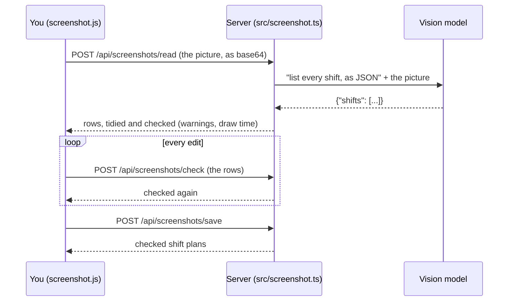

# Stage 4: how it works

Stage 4 lets you add a week of shifts from a **screenshot** of your work schedule instead of typing them in. According to [DESIGN.md](../DESIGN.md), its new concepts are **image input, structured output and validation**.

## The big picture



1. In the planner, **Import screenshot** and pick the picture.
2. The **screenshot-reading profile** reads it.
3. The **review list** shows what was read beside the screenshot: every shift with its day, shift type, shift hours, draw hours and draw time (calculated, greyed).
4. Fix anything by tapping it. ⚠️ **Warnings never block**; they point out what's worth a second look.
5. **Looks good, save** turns every row into a checked shift plan.

The screenshot itself is never saved: it stays in the browser until you close the dialog.

## Concept 1: image input

Some models can read pictures: they're called **vision** (or multimodal) models. Jev, the decision model coming in stage 7, can't, and neither can many chat models. So stage 4 adds a new job with its own assignment: **Settings → Screenshots are read by**, a connection profile whose model can read images (DESIGN.md suggests Gemini Flash). It's a profile, not a roulette, because you want one model you know reads schedules well.

How does a picture go into a request that's JSON text? As a **data URL**: the image's bytes written as base64 (a way of writing any bytes using only letters, digits, `+` and `/`), with a label saying what they are:

```
data:image/png;base64,iVBORw0KGgoAAAANSUhEUgAA...
```

In the chat completions format, a message can be a list of **parts** instead of plain text, and a part can be an image (`ContentPart` in `src/types.ts`):

```json
{
  "role": "user",
  "content": [
    { "type": "text", "text": "Here's my schedule. List every shift." },
    { "type": "image_url", "image_url": { "url": "data:image/png;base64,..." } }
  ]
}
```

The browser reads the file as base64 (`readAsBase64`, the same function the theme editor uses for images), and sends it inside JSON, so the server's "changes must be JSON" protection still applies. Screenshots can be PNG, JPEG, WebP or GIF, 10 MB at most.

## Concept 2: structured output

A chat model writes text. Here we want **data**: a list of shifts with dates and times, in a shape code can use. That's **structured output**, and the trick is simply to ask for it clearly (`schedulePrompt` in `src/screenshot.ts`):

- say exactly what shape to reply in, with an example
- say what each field means, and what format (24-hour `HH:MM`, `YYYY-MM-DD`)
- say what to do when unsure: `null`, rather than guessing
- give it **today's date**, because schedules say "Mon 9/28", not "2026-09-28"

Models don't always oblige tidily, so the reply goes through two forgiving steps:

1. **`extractJson`** (`src/json.ts`) finds the JSON even when it's wrapped in ```json fences or after "Here are the shifts:", and repairs trailing commas and curly quotes. If there's no JSON at all, you get a clear error suggesting the profile isn't a vision model.
2. **`parseScheduleReply`** tidies each value: `9:00a`, `9:00 AM`, `9am` and `09:00` all become `09:00`; `Mon 9/28` becomes a real date, with the year that puts it **closest to today** (so a schedule for early January read in late December lands in next year); "On call" and "on-call" become `oncall`, "Training" becomes a meeting.

## Concept 3: validation

Validation means deciding what's **wrong**, what's **suspicious**, and what's **fine**. Stage 3 had validation that refuses bad plans. Here there are two levels (`checkRows`):

**Errors** stop a row being saved, because it can't be a plan at all:

- no date
- no shift hours

**Warnings** (⚠️) never block. DESIGN.md is firm about that: the model might have misread, but you're the one looking at the screenshot, so you decide:

| Warning | Why |
| --- | --- |
| Regular shift with no draw hours | Regular shifts usually have them |
| Draw hours are outside the shift hours | A draw can't happen off the clock |
| "The screenshot says Wed, but 9/29 is a Tuesday" | The weekday it read doesn't match the date: a classic misread |
| A 20-hour shift? / A 10-minute shift? | Longer than 16 hours or shorter than 30 minutes |
| This date is far from today | More than 45 days away: probably the wrong year |
| Meetings don't have draw hours | They'll be left out |
| Already in the planner / in the list twice | Same date and hours |

To ask for the weekday check, the prompt has the model write the weekday **as it appears on the screenshot**, separately from the date. If the two disagree, one of them was misread.

The calculations reuse the planner's own (`shiftFacts` from `src/planner.ts`): each row is treated as an unsaved shift plan, so an overnight shift ends the next day, and **draw time is calculated from the draw hours**, exactly as it will be once saved. Double-booked days are simply two rows.

### Checking again after every edit

When you change a field in the review list, `screenshot.js` waits 300 ms for you to stop, then sends all the rows to `POST /api/screenshots/check` and updates the weekday, draw time and warnings, without redrawing the boxes (so you don't lose your place while typing). The rules live in one place, on the server, and the browser never has its own copy to disagree with.

Rows coming back from the browser are checked field by field (`rowsFromRequest`): anything that isn't a proper date or time becomes empty, which then shows as an error.

### Saving

**Looks good, save** sends the rows to `POST /api/screenshots/save`. Every row becomes a shift plan with `checked: true` and `source: "screenshot"`, titled "Work", "Meeting" or "On call". It's **all or nothing**, in one database transaction: if row 3 has no date, nothing is saved and you're told "Row 3: needs a date."

## Tests

- `test/screenshot.test.ts`: `extractJson` on messy replies; tidying times, dates (including the year closest to today) and shift types; every warning and error; the request sent to the vision model (its profile, today's date in the prompt, and the picture as a data URL); a model that can't read images; checking edited rows; saving all or nothing.
- `test/ui.test.ts`: the whole flow in a browser: pick a screenshot, see the warning, fix the draw hours and watch the warning go and the draw time appear, remove a row, save, and see the shifts on the calendar.

Which vision model reads your schedule most reliably is one of DESIGN.md's open questions. That needs a real screenshot and a real key: see the live test notes in the README.
